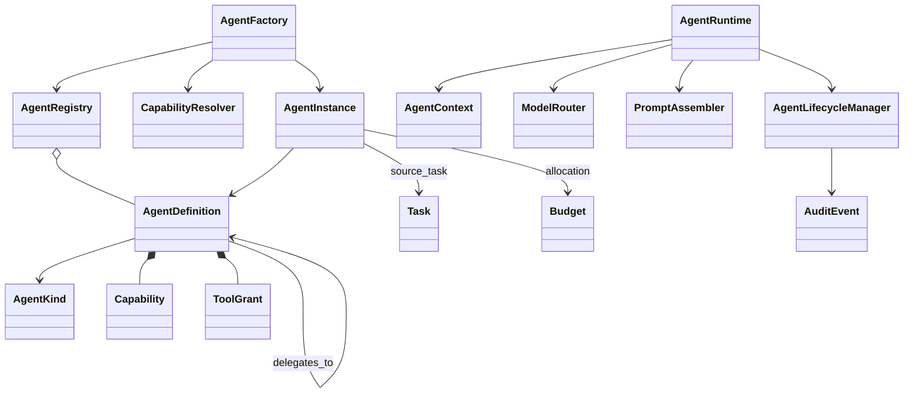
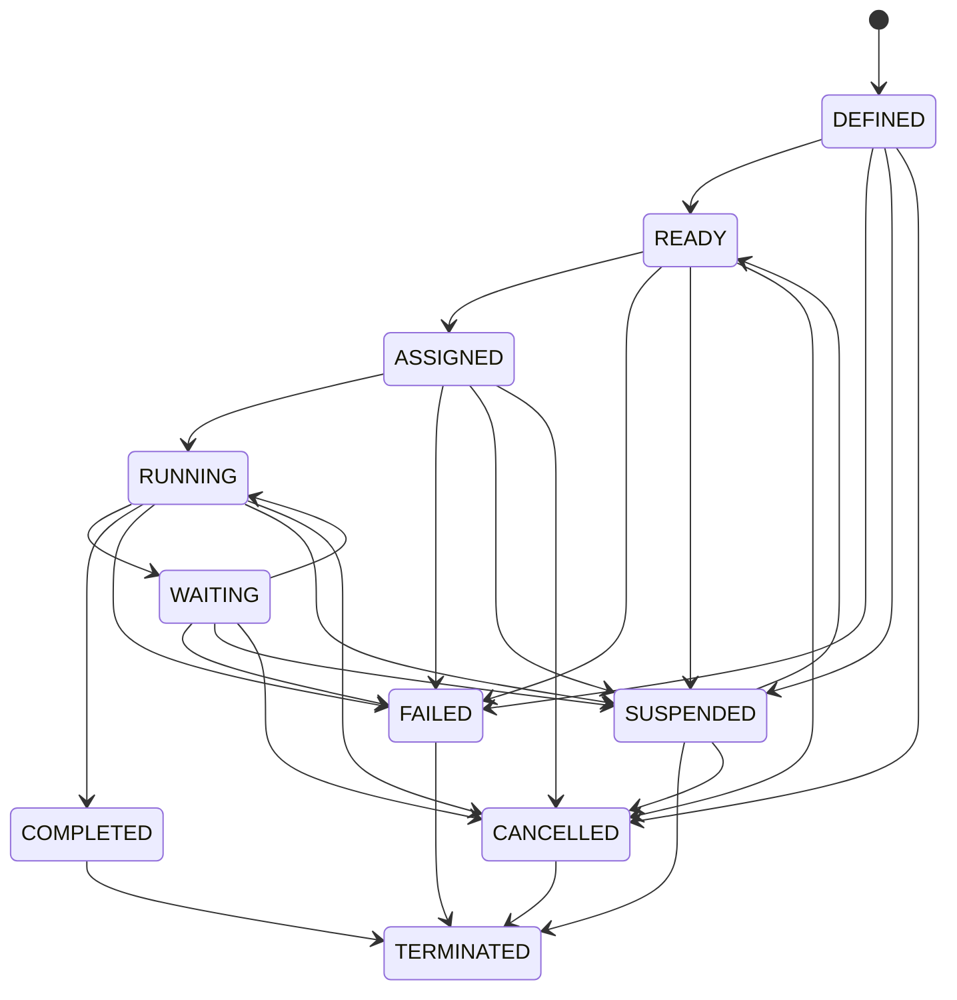

# Agent model and runtime lifecycle

## Scope

Phase 03 adds a multi-agent foundation without implementing the complete company workflow or routing production requests away from `SkillAgent`. Role definitions can be loaded from declarative JSON, validated as a hierarchy and persisted through the Phase 02 repository ports. Instances remain separate from definitions, allowing long-lived organizational roles and short-lived workers.



## Agent kinds

### Role agents

`AgentKind.ROLE` represents long-lived organizational accountability. A definition can record mission, role prompt, department, policies, capabilities, delegate templates, logical model profile, memory scopes and numeric limits. Role definitions are persistent; runtime instances are versioned lifecycle records.

### Worker agents

`AgentKind.WORKER` definitions are reusable templates. `AgentFactory.create_worker()` requires:

- a declared ROLE parent that can delegate to the worker template;
- a source Task and Work Order;
- a future UTC expiration;
- an isolated context ID;
- a budget allocation ID;
- requested capabilities that are a subset of both parent grants and worker-template declarations.

Workers never gain capabilities by inheritance alone. The caller must request an explicit reduced set. Expired workers are cancelled and terminated through audited lifecycle transitions.

### Control agents

`AgentKind.CONTROL` represents reviewers and constraints. `CapabilityResolver.assert_control_review()` rejects self-review and does not infer write access from review capability. Actual policy decisions and approval persistence remain later-phase responsibilities.

## Definition format

Phase 03 uses JSON to avoid adding a YAML dependency. A file contains either a top-level list or `{ "agents": [...] }`.

```json
{
  "agents": [
    {
      "id": "product_manager",
      "name": "Product Manager",
      "kind": "ROLE",
      "department": "product",
      "reports_to": "chief_of_staff",
      "mission": "Convert goals into testable requirements.",
      "capabilities": ["read_repository", "create_artifact", "delegate"],
      "delegates_to": ["business_analyst_worker"],
      "model_profile": "balanced_reasoning",
      "memory_scope": ["agent", "department", "organization_read"],
      "limits": {"max_parallel_tasks": 3}
    }
  ]
}
```

`AgentRegistry` rejects duplicate IDs, unknown managers/delegates, self-reporting and reporting cycles. It can hydrate from or persist to any `AgentDefinitionRepository`; the SQLite restart test proves local durability.

## Lifecycle



`AgentLifecycleManager` validates every allowed edge, returns a new versioned instance and emits one `AuditEvent` for every successful state change. Invalid transitions emit nothing. The enum retains Phase 02 compatibility values (`IDLE`, `ACTIVE`, `RETIRED`), but the new runtime transition table does not use them.

## Structured execution

`AgentRuntime` accepts an ASSIGNED `AgentContext`, transitions it to RUNNING, assembles controlled prompts, resolves a logical model profile and calls the completion port. Output must contain exactly:

```json
{
  "status": "completed|needs_input|blocked|failed",
  "summary": "...",
  "artifacts": [],
  "proposed_tasks": [],
  "handoff": null,
  "policy_requests": [],
  "usage": {}
}
```

The result validator checks exact keys, types, bounded status and non-negative usage. The runtime permits zero to two repair calls. Invalid output never creates artifacts, tasks, handoffs or policy requests; after repair exhaustion it records an audited FAILED transition.
