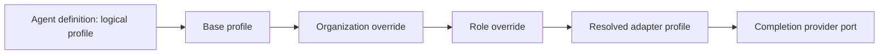

# Agent model routing

## Logical profiles

Agent definitions reference logical names rather than vendor models:

- `fast_classifier`
- `balanced_reasoning`
- `deep_reasoning`
- `code_generation`
- `review`
- `local_private`

`RoutedModelProfile` belongs to the adapter/runtime layer and maps a logical name to provider, model, legacy role, base URL, token limit and temperature. No provider or model name is hardcoded in the domain model.

## Resolution order

`ModelRouter` resolves settings in deterministic order:

1. configured base logical profile;
2. organization override for that profile;
3. role/agent-definition override for that profile.

The last layer wins only for explicitly supplied fields. Unknown profiles and invalid token limits fail before a provider call.

## Legacy provider adapter

`LegacyProviderAdapter` wraps the existing `core.llm.LLM` and preserves `config.json` behavior. It maps `fast_classifier` to `roles.chat`; reasoning, generation, review and private profiles default to `roles.work`. Mapping can be overridden without deleting or renaming `roles.chat` and `roles.work`.

The adapter calls the existing provider abstraction with the resolved temperature/token limit. API-key resolution remains in `core.config`; model profiles do not contain credentials. Phase 03 does not change production configuration or instantiate this adapter from `SkillAgent`.

## Configuration direction

Later phases may read logical profiles and overrides from organization configuration, but they must keep provider details outside the domain package and must not store secrets in agent definitions or SQLite JSON payloads. Missing profile configuration is a deterministic error, not a prompt fallback.
