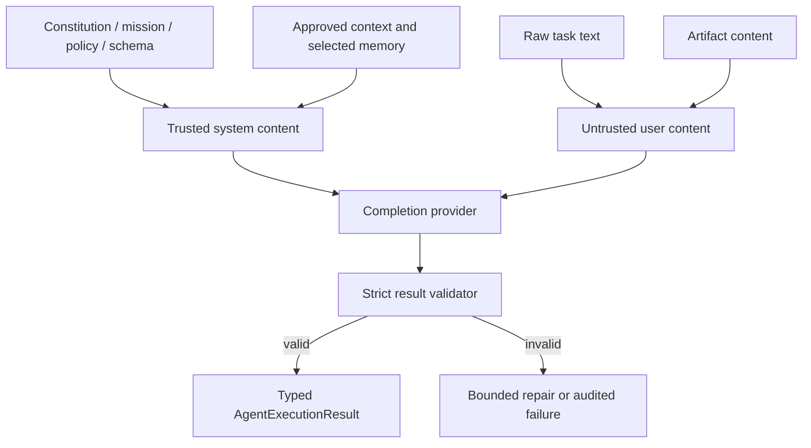

# Agent prompt trust boundaries

## Controlled assembly

`PromptAssembler` accepts only an `AgentContext` prepared by application code. It creates two messages:

- a trusted system message containing constitution, role mission, Work Order, Task metadata, acceptance criteria, allowed capabilities, forbidden actions, approved context, relevant memory and required output schema;
- an untrusted user message containing raw task and artifact content inside explicit delimiter tags.

## Rules

1. Raw task/artifact content is never concatenated into the system message.
2. Approved context and memory must be selected before prompt assembly; the assembler does not query storage.
3. Capabilities in the prompt describe a grant already decided by code. They do not authorize execution.
4. Forbidden-action text is defense in depth; policy enforcement remains code-owned.
5. Model output is parsed as untrusted data and must match the exact schema.
6. Malformed output cannot directly mutate domain Task, Artifact, Approval or Budget state.
7. Repair prompts report validation errors but do not broaden permissions.
8. Prompt construction never includes API keys or raw secrets.

## Known boundary limits

Delimiters do not make hostile content safe by themselves. The runtime still needs policy enforcement, scoped execution, artifact validation and output-size/token limits in later phases. Relevant memory is currently treated as approved by the caller; provenance-aware memory promotion is not implemented yet.
