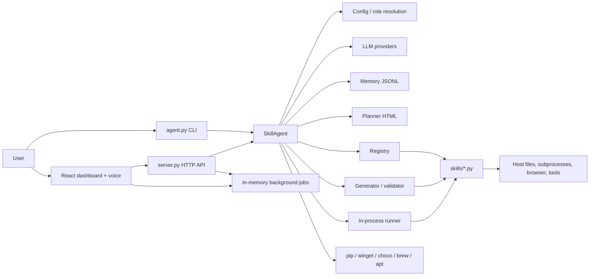
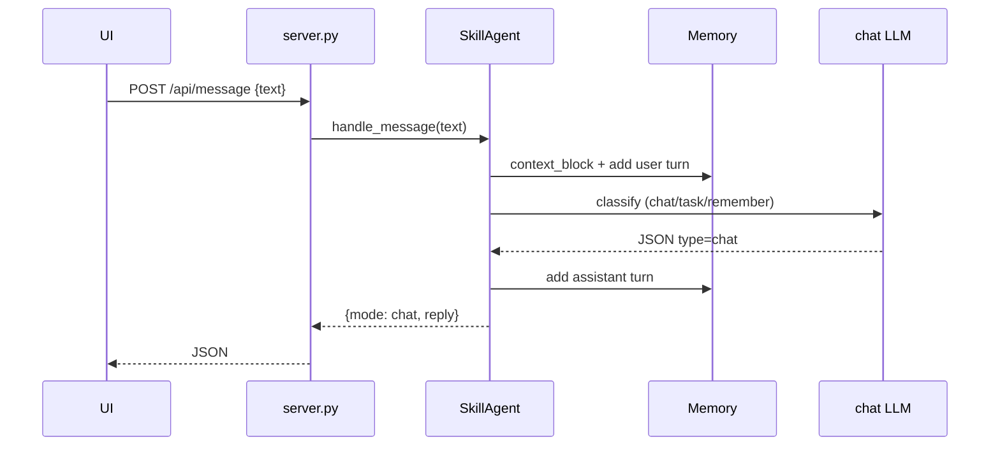
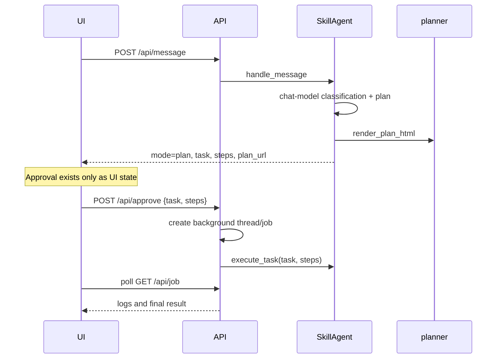
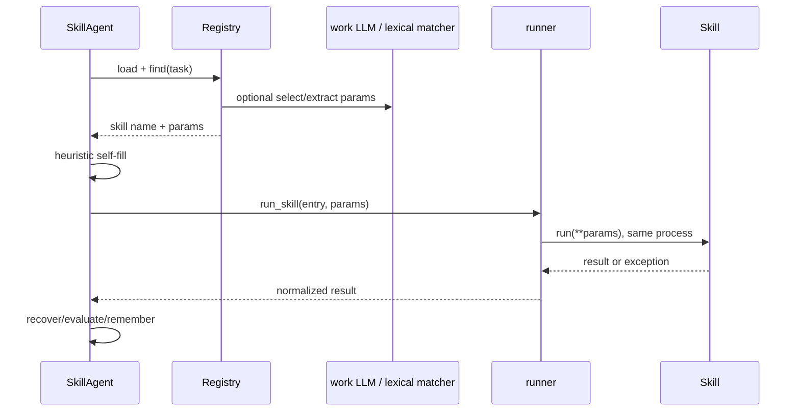

# Current-state architecture

## Scope and evidence

This map describes the repository as inspected on 2026-07-22. Source code is treated as authoritative. The primary runtime is a single in-process `SkillAgent`; “agent” currently means one orchestrator with two model roles (`chat` and `work`), not a governed multi-agent organization.

## Components

## Entry points and responsibilities

| Component | Actual responsibility |
|---|---|
| `agent.py` | Interactive and one-shot CLI. It calls `SkillAgent.execute_task` directly; it does not use chat classification or approval. |
| `server.py` | Standard-library HTTP server, static dashboard serving, configuration editing, TTS, in-memory threaded jobs, polling, and dev reload. |
| `core.orchestrator.SkillAgent` | Classification, planning, decomposition, selection/generation, execution, recovery, evaluation, memory writes, and user-question fallback. This is the main coupling hotspot. |
| `core.config` | Loads `config.json`, resolves `chat`/`work` provider, model, key, and base URL. |
| `core.llm` | Provider adapter for OpenAI-compatible endpoints, Anthropic, Gemini, local/9router, and deterministic mock behavior. It may install missing SDKs. |
| `core.registry` | Loads Python skills, normalizes metadata, matches skills, and extracts parameters. It executes skill source during discovery. |
| `core.generator` | Prompts the work model for a skill, parses and writes Python, compiles/smoke-validates it, and supports code repair. |
| `core.runner` | Calls a skill's `run(**params)` in the server/CLI process and normalizes crashes. |
| `core.memory` | In-memory working history backed by JSONL chat and fact files; lexical recall with recency weighting. |
| `core.planner` | Writes timestamped, escaped HTML plans under `plans/`. |
| `core.tools` | Converts skill metadata to OpenAI/Hermes schemas and parses tool calls. It is not the primary execution route. |
| `core.autoinstall` | Detects missing modules and performs host `pip install`; controlled only by `AGENT_NO_AUTO_INSTALL`. |
| `selftest.py` | Script-style offline integration checks using mock LLM and temporary fixtures, with manual pass/fail counters. |

## Runtime flows

### Chat-only message

### Task and current approval path

`/api/reject` only returns `{ok: true}`. There is no persisted approval record, identity, policy evaluation, expiry, binding to a plan hash, or server-side requirement that a task was approved. CLI execution bypasses approval entirely.

### Existing skill execution

### Missing skill generation

The work LLM returns code and optional parameters. `generator.generate` parses the response, creates a unique filename, and writes it to `skills/`. `SkillAgent._test_new_skill` reloads the registry, compiles/validates and smoke-runs it. A crashing skill can be repaired with `generator.fix`; an unaccepted generated file is removed. An accepted skill is recorded as a memory fact and then executed through the same runner.

### Failure and recovery

`_recover` is bounded by `MAX_RECOVER=4`, but the outer goal loop has `MAX_ROUNDS=0` (unbounded until stall detection). Recovery may install a Python package, discover or install a system tool, self-fill parameters from the working directory, ask the LLM for parameter/diagnostic advice, retry another skill, generate a replacement, or fix code. Required missing parameters return `needs_input` and an `ask` string. Decisions are not governed by explicit capabilities or policy.

### Multi-step pipeline

`execute_task` uses approved UI steps on the first round when supplied; otherwise `_decompose` asks the work model. `_run_pipeline` executes steps sequentially, passes a short textual result from the prior step, optionally asks the model to verify each result, and stops on failure or missing input. This is a list, not a persisted DAG: it has no stable task IDs, explicit dependencies, idempotency keys, resumable state, ownership, or concurrency rules.

### Memory recall

`Memory` loads `memory/facts.jsonl` and the active `memory/chat_<session>.jsonl`. `handle_message` injects lexical fact recall and recent turns into the chat system prompt. Task execution wraps the LLM with `_CtxLLM`, adding the goal, selected memory, and bounded execution logs. Successful tasks and accepted skills append new facts.

### Dashboard approval and jobs

The React controller creates a client-side plan object, posts its task and editable steps to `/api/approve`, then polls `/api/job?id=...&from=...`. Jobs live only in the process-global `JOBS` dictionary and execute in daemon threads sharing one `SkillAgent`. Restart loses state; job ownership and authorization are absent.

### Mock self-test

`selftest.py` builds a `SkillAgent` with mock chat/work providers and temporary memory. It exercises registry loading, classification, planning, generation/reuse, memory, Hermes schemas, validation, parameter recovery, mocked installation, and a two-step pipeline. It writes temporary skills/plans into production directories and attempts cleanup at the end. It is not isolated by a test framework.

## Configuration flow

`Config.load()` reads `config.json`. `Config.resolve(role)` applies role values, then provider defaults, then environment API keys. `SKILL_AGENT_PROVIDER` overrides the default provider. The server reloads configuration on requests and updates it atomically through `/api/model-config`; keys are never returned, although status exposes their last four characters. `agent.config.json` supplies display/speech identity via `core.identity`, not model behavior.

Supported code paths are OpenAI, DeepSeek, 9router and local through the OpenAI SDK; Anthropic; Gemini; and mock. Provider SDK imports may trigger host package installation from `core.llm._import`.

## Storage conventions

| Data | Location | Properties |
|---|---|---|
| Model configuration | `config.json` | Mutable JSON, atomically replaced by server settings endpoint. |
| Identity | `agent.config.json` | Mutable JSON; falls back to `SKYNET`. |
| Skills | `skills/*.py` | Executable source; generated and repaired in place. |
| Plans | `plans/plan_YYYYMMDD_HHMMSS.html` | Timestamp-named HTML, not linked to a stable work-order ID. |
| Long-term facts | `memory/facts.jsonl` | Append/rewrite JSONL; IDs are random hex fragments. |
| Chat history | `memory/chat_<session>.jsonl` | Append-only per session until explicitly cleared. |
| Jobs | process memory | Ephemeral dictionary; no restart recovery or audit history. |
| Dashboard build | `dashboard/dist/` | Generated Vite assets served by `server.py`. |

## External dependencies

- Python standard library for CLI/server/core baseline.
- `openai`, `anthropic`, or `google-generativeai` according to provider; the code installs SDKs on demand.
- React, React DOM, Three.js, Vite and the React Vite plugin for dashboard development.
- `edge-tts` for server-side speech, installed on demand.
- Skill-specific Python packages and host binaries such as ffmpeg/ffprobe.
- Optional system package managers: winget/choco, brew, or apt-get.

## Coupling hotspots

- `SkillAgent` combines application orchestration, domain decisions, model prompting, execution, recovery, persistence calls, and evaluation.
- `server.py` owns HTTP, configuration writes, lifecycle, reload, jobs and execution threading.
- Registry loading executes module top-level code and may mutate the host by installing imports.
- Memory, plan and skill paths are global package constants rather than injected ports.
- Dashboard contracts are unversioned dictionaries shared implicitly with server responses.
- Auto-reload replaces the global agent while existing worker threads may still use the prior instance.

## Unsafe execution points

- Registry `exec(compile(source))` executes arbitrary top-level skill code.
- Runner invokes generated and existing skills in the trusted process with ambient host permissions.
- `skills/run_command.py` permits subprocess execution; other skills open browsers and invoke host tools.
- Missing imports can trigger automatic host package installation during registry load, LLM initialization, TTS, or recovery.
- Recovery can invoke OS package managers without durable approval.
- LLM-generated code and diagnostic suggestions influence execution despite only syntactic/static validation.
- API has no authentication, CSRF protection, request size limit, persisted approvals, resource budget, or execution scope. Binding to loopback reduces exposure but is not a complete boundary.
- Concurrent jobs share mutable agent state, registry and memory without end-to-end synchronization.

## Compatibility-sensitive APIs

- `SkillAgent(config=None, memory=None, session="default")`.
- `handle_message(text) -> {mode, reply}` or `{mode: plan, task, steps, plan_file, plan_url}`.
- `execute_task(task, log=None, steps=None) -> result dict` including `success`, `skill`, `params`, `result`, `error`, `logs`, `needs_input`, and pipeline fields.
- Skill contract: `SKILL_META` plus `run(**kwargs) -> dict`.
- `Config.load`, `Config.resolve("chat"|"work")`, existing JSON layout and environment variables.
- HTTP endpoints: `/api/health`, `/api/model-config`, `/api/message`, `/api/approve`, `/api/reject`, `/api/job`, `/api/tts`, `/api/tts-check`, and `/plans/<name>`.
- Hermes schema/tool-call helpers and persisted JSONL formats.
- CLI arguments and server port behavior.

## Missing test coverage

- No `tests/` suite or automated endpoint, CLI, concurrency, reload, dashboard, provider-adapter, security, or failure-path tests.
- No tests for authorization, approval integrity, scope enforcement, sandboxing, budgets, retries across restarts, idempotency, audit completeness, or secret redaction.
- Self-test mutates shared `skills/` and `plans/`, depends on current repository contents, and has two baseline assertion failures.
- On the inspected Windows console, a normal `python selftest.py` can fail early with CP1252 output encoding; `PYTHONIOENCODING=utf-8` is required for a complete run.
- No JavaScript test script exists. The available shell has no `npm` executable, so the dashboard build could not be independently rerun in this phase.

## README gaps

- README describes `MAX_FIX` as default 2, while code sets `SkillAgent.MAX_FIX = 0` and comments that zero means repair until success/stall.
- README presents approval as a workflow step, but approval is not enforced by server/domain code and CLI bypasses it.
- README describes automatic installation as a feature without emphasizing that it mutates the host and lacks durable approval/policy.
- README implies old `parameters` metadata is normalized; baseline self-test shows that compatibility assertion currently fails for the repository's `video_meeting_summary` expectation.
- README does not disclose that registry loading executes top-level skill code, jobs are ephemeral, or pipeline state is not resumable.
- README lists only a small subset of the actual built-in skill files.
