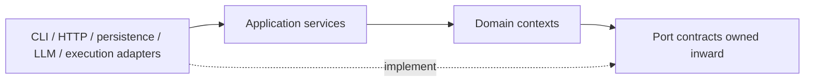

# Domain boundaries and dependency rules

## Allowed dependency direction

Domain code has no dependency on `server.py`, React, provider SDKs, filesystem paths, subprocesses or concrete databases. Application services coordinate domain aggregates and ports. Adapters translate external protocols and legacy interfaces.

## Context contracts

| Context | Inputs | Outputs | Forbidden ownership |
|---|---|---|---|
| Organization | Role definitions and organization commands | Validated role/accountability model | Scheduling, permissions, prompts |
| Agents | Assignment request and capability profile | Ephemeral instance descriptor | Self-authorization, approvals |
| Goals/Work Orders | Structured intent and commands | Versioned aggregates and events | Natural-language parsing, execution |
| Task orchestration | Persisted task graph and results | Ready/blocked/completed transitions | Goal interpretation, policy parsing |
| Collaboration | Typed messages | Correlated immutable envelopes | Free-form command execution |
| Governance | Actor, action, resource, risk, budget | Allow/deny/approval-required decision | Prompt-only enforcement, execution |
| Execution/skills | Authorized execution envelope | Bounded result and artifact references | Permission inference, host installation |
| Memory/knowledge | Provenanced observations | Scoped recall and promotion decisions | Audit truth, silent fact promotion |
| Artifacts | Bytes/metadata/provenance | Immutable version reference | Executing content, workflow approval |
| Observability | Domain events | Redacted trace/audit/evaluation records | Domain state transitions |
| UI/API | Authenticated DTOs | Commands and projections | Direct skill/persistence access |
| Legacy compatibility | Old calls/data | Translated commands/results | New domain policy |

## Non-negotiable rules

1. UI and HTTP handlers never directly execute skills. They submit application commands.
2. Agent prompts and model outputs never decide permissions, approval validity, budget enforcement or final state.
3. The scheduler never parses natural-language goals; it receives validated tasks and dependency edges.
4. Persistence adapters store and retrieve state but cannot define transition, readiness or policy rules.
5. Review agents cannot review or approve artifacts they produced. Governance validates actor separation in code.
6. Artifacts retain producer, task, Work Order, content/version integrity and source provenance.
7. The legacy compatibility layer translates interfaces only and cannot bypass governance for new-runtime commands.
8. Cross-context communication uses typed commands/events with schema versions and correlation IDs, not unrestricted prose.
9. One accountable owner exists for each Work Order and Task, even when temporary workers collaborate.
10. Execution consumes an explicit, time-bounded capability grant and returns bounded, serializable results.

## Aggregate invariants

- A Work Order cannot enter execution without acceptance criteria, an owner and a valid task graph.
- A Task cannot become ready until all required dependencies are complete and policy requirements are satisfied.
- A risky task cannot dispatch without a persisted approval matching action, scope and current artifact/plan version.
- A reviewer identity cannot equal the producer identity for mandatory independent gates.
- Budget exhaustion deterministically blocks further dispatch; an LLM cannot override it.
- Completion is derived from task states, required reviews and acceptance evidence.
- Artifact versions are immutable; corrections produce new versions linked to predecessors.
- Duplicate delivery of an execution result cannot repeat an irreversible transition.

## Legacy isolation seam

The first integration seam is an application-level facade that can route to either `LegacySkillAgentAdapter` or the new Work Order service. Existing CLI and HTTP contracts remain on the outer side. New code must not import private `SkillAgent` methods; the adapter is the only allowed dependency on the legacy orchestrator.
