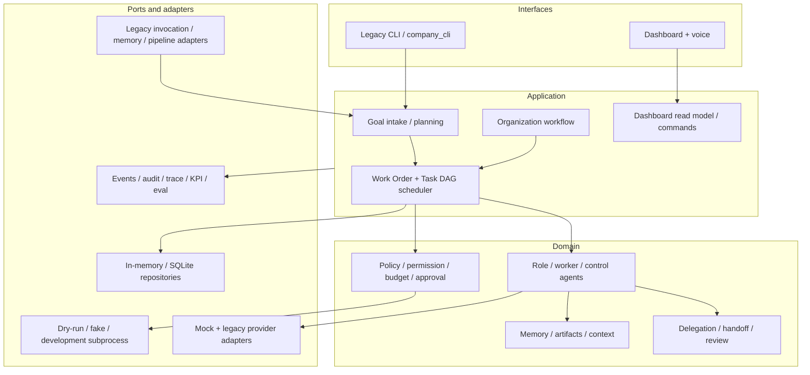
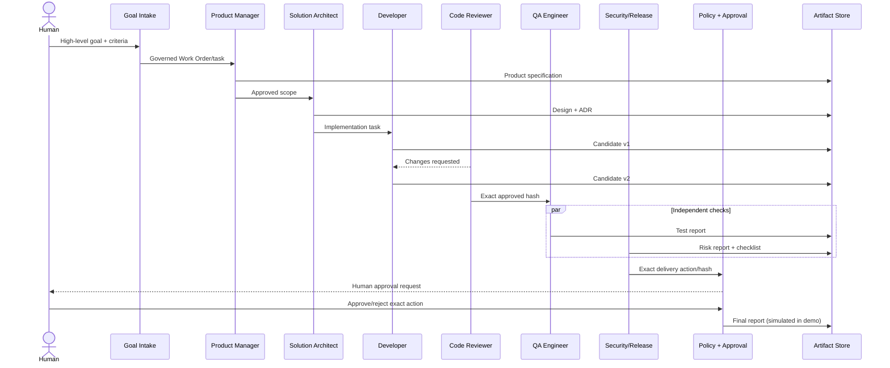
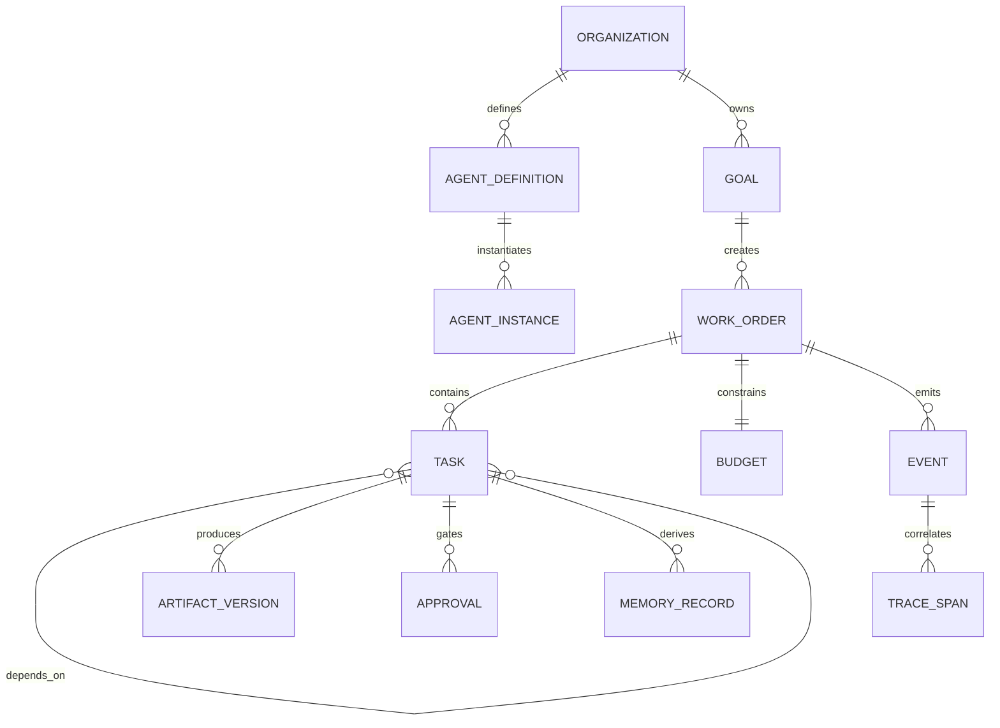

# Final system overview

## Component model

Interfaces do not access repositories or the skill runner directly. Application services coordinate domain objects and invoke ports. Governance decisions occur before execution; task/work-order mutations pass through state machines.

## Feature-delivery sequence

## Core data model

Stable IDs and explicit JSON serialization cross boundaries. Work Orders/Tasks have deterministic bounded states. Artifact versions are immutable by hash and carry producer/task provenance. Memory records carry scope, owner, sensitivity, validation and provenance.

## Security boundaries

Untrusted goals, model output, retrieved files and skill metadata remain outside trusted system/policy instructions. Structured-output validation precedes domain use. Permission and policy engines are deny-by-default; budgets gate dispatch; approvals bind action, arguments hash, actor, task/work order, constitution and expiration. Secrets are referenced by ID/environment name and redacted from events. Generated skills do not receive unrestricted host access.

The included restricted subprocess adapter cannot enforce a security boundary and must not be used as a production sandbox. Production needs an isolation adapter plus tenant authentication/authorization, managed secrets and durable externally anchored audit.

## Deployment modes

| Mode | Intended use | External effects |
|---|---|---|
| Mock | Unit/eval/demo | None |
| Dry-run | Safe default/preview | None |
| Sandbox | Production candidate with a real isolation adapter | Only governed/approved scope |
| Legacy unsafe | Explicit local compatibility only | May mutate host; not production |

Legacy and organization runtimes are independently feature flagged. SQLite is the local durable adapter; in-memory adapters support tests. The current HTTP server/dashboard is developer-grade.

## Extension points

Repository protocols allow managed databases; completion provider ports allow model vendors; sandbox ports allow real isolation; artifact/memory ports allow object/vector stores; event/trace sinks allow durable telemetry/OpenTelemetry; policy/secret adapters allow enterprise control planes; workflow templates allow new governed delivery patterns.

## Legacy compatibility

Legacy CLI, dashboard message/approval routes, chat/work model split, providers, skill lookup/generation/validation/repair, parameter extraction, pipelines and JSONL memory remain operational. Compatibility adapters project legacy invocations/pipelines into governed concepts without silently rerouting execution. JSONL migration is optional, dry-run first, backed up and repeatable.
