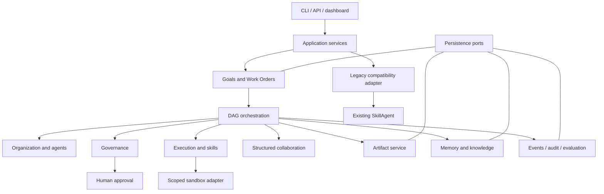

# Target-state architecture

## Architectural shape

The target is a governed organization runtime layered beside the legacy path. A goal enters an application service, becomes a versioned Work Order and dependency graph, and is executed by ephemeral role instances through explicit ports. Deterministic code controls state, policy, budgets, approvals and completion. LLMs interpret and propose but cannot authorize.

## Bounded contexts

### Organization

Owns role definitions, organization membership, accountability rules and eligibility constraints for Chief of Staff, Product Manager, Solution Architect, Developer, Code Reviewer, QA Engineer, and Security & Release Officer.

Must not own prompt execution, task scheduling, policy decisions, artifacts, or persistence implementation.

### Agents

Owns stable role-agent profiles and lifecycle of temporary worker instances, capability declarations, assignment eligibility and provider/model selection requests.

Must not grant its own permissions, approve work, directly mutate Work Order state, or persist through concrete storage APIs.

### Goals and Work Orders

Owns high-level Goal, clarified intent, Work Order scope, acceptance criteria, accountable owner, lifecycle state, versions and stable IDs. It validates deterministic transitions.

Must not parse natural language, execute skills, schedule ready tasks, or decide policy.

### Task orchestration

Owns task DAGs, dependency readiness, assignment commands, attempts, leases, idempotency keys, retry/timeout rules and roll-up completion. It consumes structured plans rather than natural-language goals.

Must not interpret user intent, evaluate permissions, implement storage, or allow free-form agents to create undeclared execution edges.

### Collaboration

Owns typed handoff, review request, review finding, clarification and status messages with sender, recipient, correlation and schema version.

Must not serve as an unrestricted agent chat bus, authorize actions, or directly change task completion.

### Governance

Owns deny-by-default policy, permission scopes, risk classification, separation of duties, approval requirements, approval records, budgets and release gates. Reviewers cannot approve their own output; approval binds actor, action, scope, artifact/version and expiry.

Must not rely on prompts for enforcement, execute actions, or let persistence adapters define policy semantics.

### Execution and skills

Owns skill descriptors, validation status, execution requests/results, capability mapping and execution ports. A sandbox adapter enforces file/network/process/package scopes, timeouts and output limits. Generated skills are quarantined until validated.

Must not install host packages autonomously, infer authorization, own Work Order state, or expose ambient shell access.

### Memory and knowledge

Owns working context, episodic records, validated organizational knowledge, provenance, retention and promotion rules. Facts require source and confidence; promotion is a governed action.

Must not be the audit log, silently convert model claims into facts, or determine permissions and workflow state.

### Artifacts

Owns immutable/versioned artifact metadata, content addressing or version IDs, producer/task provenance, media type, integrity and retention. Mutations create new versions.

Must not execute artifact contents, decide acceptance, or store untraceable paths as final results.

### Observability

Owns structured domain events, append-only audit records, trace correlation, metrics and evaluator results with redaction. Important commands and state changes emit events.

Must not become a second source of workflow truth, leak secrets, or determine domain transitions.

### UI/API

Owns authenticated request/response DTOs, input limits, presentation, polling/streaming and explicit human approval interactions. It calls application services only.

Must not execute skills, manipulate persistence directly, invent domain state, or treat a button click without a validated server command as approval.

### Legacy compatibility

Owns adapters that preserve `SkillAgent`, CLI, HTTP response shapes, JSON configuration, skills, plans and memory while traffic is migrated behind feature flags.

Must not accumulate new domain rules, become permanent orchestration, or bypass governance for new-runtime work.

## Role workflow

Chief of Staff owns intake and organizational coordination. Product Manager produces clarified requirements and acceptance criteria. Solution Architect proposes architecture and the task graph. Developer produces implementation artifacts. Code Reviewer independently reviews code. QA Engineer validates behavior and failure paths. Security & Release Officer independently applies security/release gates and requests human approval for external or risky actions. Role instances are ephemeral per assignment; the Work Order retains accountability and history.

## Deterministic control plane

Every Goal, Work Order, Task, AgentInstance, Approval, Artifact and Event has a stable ID and explicit JSON serialization. Enums define bounded states and aggregate methods validate transitions. Commands are idempotent where feasible. Scheduler readiness is computed solely from persisted task states and dependency edges. Completion requires acceptance evidence and all mandatory review gates, not a model assertion.

Ports isolate Work Order storage, event/audit storage, artifact storage, memory, LLM providers, clocks, ID generation, policy evaluation and skill execution. Initial adapters may remain filesystem/in-memory and standard-library based; production replacements can be added without moving domain rules.

## Security model

Execution requests carry an explicit capability grant: allowed files, network destinations, subprocesses, packages, secrets, time, tokens and output size. Policy evaluates the declared action before dispatch. High-risk or externally visible operations remain pending until a matching unexpired human approval is recorded. Audit events contain redacted metadata and hashes rather than secrets. No generated HTML or code is executed merely because an LLM produced it.

## Compatibility strategy

New organization endpoints and services are additive. A `LegacySkillAgentAdapter` initially delegates old CLI/API behavior unchanged. Feature flags select legacy or governed flows per request. Existing provider roles remain usable through an LLM port adapter; existing skills remain discoverable through a legacy skill catalog adapter. Removal occurs only after parity tests, data migration, documented rollback and at least one release with no legacy traffic.
