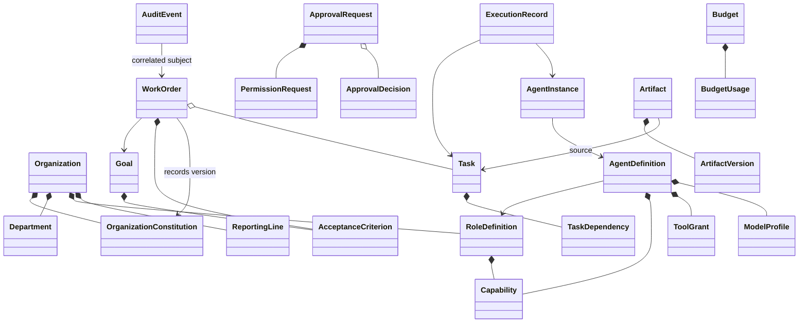
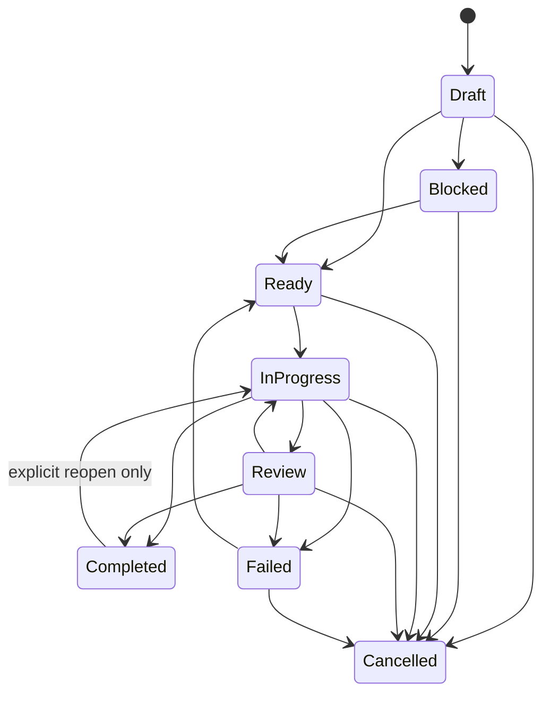

# Foundation domain model

## Purpose

Phase 02 introduces an additive, provider-independent domain foundation under `core/domain/`. It does not route legacy CLI, dashboard or `SkillAgent` execution through the new model. Domain objects are frozen dataclasses with stable string IDs, explicit enums, validated invariants, timezone-aware UTC timestamps and JSON-compatible `to_dict()` representations.

## Aggregate and value-object responsibilities

### Organization

`Organization` holds a named constitution, departments, roles and reporting lines. IDs for roles and departments must be unique. `OrganizationConstitution` requires an explicit version, at least one principle and an effective UTC timestamp. A governed `WorkOrder` stores the constitution version used for its decisions, so later constitutional changes do not erase provenance.

### Agents

`AgentDefinition` describes a reusable role, worker or control agent, its capabilities, scoped tool grants and a provider/model profile that deliberately contains no credentials. `AgentInstance` is a concrete lifecycle instance optionally scoped to a Work Order. `AgentKind` is limited to `ROLE`, `WORKER` and `CONTROL`; `AgentStatus` provides bounded lifecycle values.

### Goals, Work Orders and Tasks

`Goal` carries intent, accountable owner and acceptance criteria. `WorkOrder` has one and only one `accountable_owner_id`, a recorded constitution version, acceptance criteria and unique Task IDs. `Task` has a stable owner, priority, risk, lifecycle state and explicit dependency edges.

Self-dependencies, duplicate edges and edges whose `task_id` differs from the containing Task are rejected. Task lifecycle changes use `Task.transition()` and return a new versioned Task. Completed Tasks are terminal unless callers pass the explicit `reopen=True` transition to `IN_PROGRESS`.

When a policy requires separation of duties, `Task.require_separate_reviewer()` requires both identities and rejects a reviewer who is also the author.

### Governance and budgets

`PermissionRequest` describes actor, action, resource and scopes. `ApprovalRequest` binds it to request/expiry timestamps and an optional `ApprovalDecision`. A decision cannot remain pending and requires an actor and UTC timestamp. `PolicyDecision` records a deterministic allow, deny or approval-required result.

`Budget` sets non-negative token, cost-unit and wall-time limits. `BudgetUsage` is non-negative. `Budget.consume()` returns a new version and rejects any operation that would exceed a configured limit.

### Artifacts and trace

`Artifact` requires producer, source Task, content hash and UTC creation time. `ArtifactVersion` adds a stable version ID, monotonic positive version number, content hash and storage reference. Duplicate version numbers or versions referencing a different Artifact are rejected.

`AuditEvent` carries typed event, actor, subject, timestamp and correlation ID with JSON-compatible details. `ExecutionRecord` connects an Agent instance to a Task attempt and validates temporal ordering.

## Determinism and serialization

Production can use `UtcClock` and `UuidIdGenerator`. Tests and deterministic adapters inject a clock and `SequenceIdGenerator`. Timestamps must already be UTC and timezone-aware; naive or non-UTC datetimes are rejected.

All objects inherit a JSON conversion mixin. Repository aggregate roots implement explicit `from_dict()` constructors for lossless round trips. Enum values serialize as stable lower-case strings and UTC timestamps as ISO-8601 strings.

## Legacy compatibility

`LegacyInvocationAdapter` projects one legacy task into one default Organization, Department, legacy Role, AgentDefinition, Goal, WorkOrder and Task. It is observability-only and never calls `SkillAgent.execute_task`. `LegacyMemoryAdapter` delegates to the existing `Memory` object, preserving `memory/facts.jsonl` and `memory/chat_<session>.jsonl` behavior without copying or migrating data.
