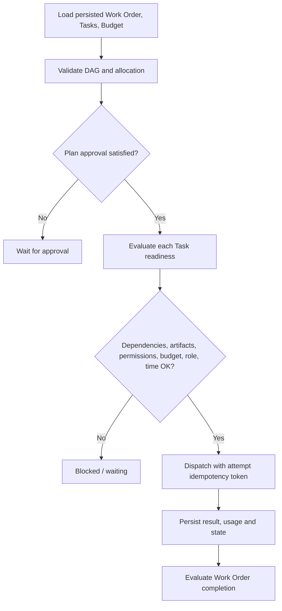

# Deterministic Task scheduler

## Tick model

`TaskScheduler` is synchronous and deterministic. Every tick reloads the Work Order, all matching Tasks and its Budget from repository ports, reconstructs and validates the graph, computes readiness, dispatches at most `max_parallelism` Tasks and persists every versioned transition/result. No external action is performed by the scheduler itself.

## Readiness conditions

A Task becomes runnable only when:

- plan approval is not required, or a matching approval has been recorded on the Work Order;
- all dependency Tasks are COMPLETED;
- required artifact IDs and permission grants are present in `SchedulingContext`;
- its assigned role is available;
- its retry backoff has elapsed and retry count is not exhausted;
- timeout has not elapsed;
- Work Order budget has sufficient remaining token, cost and wall-time allocation;
- the Work Order is IN_PROGRESS rather than paused, blocked, cancelled or terminal.

WAITING_INPUT and WAITING_APPROVAL Tasks require their ID in `resumable_task_ids` before returning to READY. This prevents repeated polling from silently treating missing human input as supplied.

## Parallelism and retries

Ready Tasks are returned in persisted repository order and only the first configured number are dispatched. The current implementation runs each selected Task synchronously, making tests reproducible; an async dispatcher can implement the same boundary later.

`RetryPolicy` requires at least one attempt and non-negative backoff. A failed attempt transitions IN_PROGRESS → FAILED; if attempts remain, it transitions FAILED → READY with a deterministic next-eligible timestamp. Exhausted FAILED/TIMED_OUT Tasks cannot be reactivated by later ticks.

## Pause, cancellation and partial failure

Paused Work Orders produce an empty tick. Resume is an explicit state-machine command. Cancellation propagates to every non-completed Task. Dependency failures keep downstream Tasks blocked and are reported in `partial_failures`; the completion evaluator only fails the Work Order when no active work remains.

## Restart safety

Work Order, Task, Budget usage, attempt count and lifecycle versions are stored through repositories. A test closes SQLite after the first Task, creates a new store and scheduler, then continues with only the dependent Task. Replaying after completion performs no dispatch and emits completion once.

There is no distributed lease/outbox in Phase 04. The synchronous dispatcher and state writes are adequate for the local MVP, but crash consistency around real external actions requires a durable dispatch ledger/outbox before asynchronous or multi-process workers are enabled.
