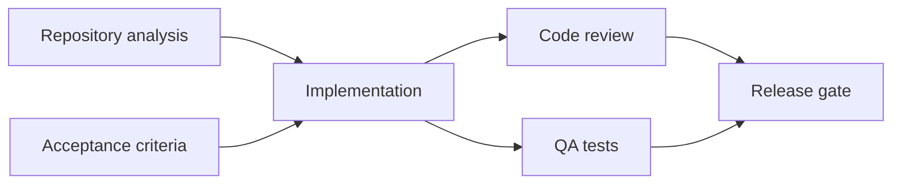
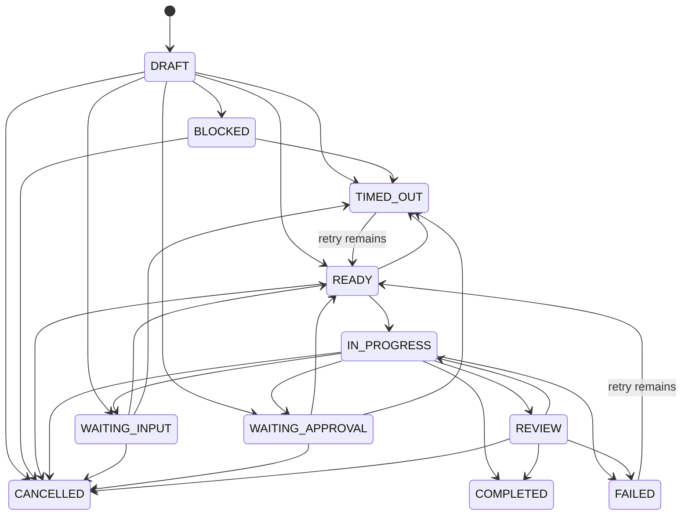

# Task DAG

## Task contract

A governed Task records title, bounded objective, accountable role, optional worker specialization, JSON-compatible inputs/output schema, acceptance criteria, dependency edges, retry/backoff, timeout, risk, required permissions/artifacts, allocated token/cost/time budget, review policy, idempotency key, lifecycle status, attempt count, next eligible time and optimistic version.

`TaskGraph` is an immutable Work Order ID plus a tuple of Tasks. Dependency edges live in each Task as `TaskDependency(task_id, depends_on_task_id)`. Helpers expose dependencies and dependents without adding hidden edges.

## Validation

`TaskGraphValidator` runs before every scheduler tick as defense in depth. It rejects:

- empty graphs and duplicate Task IDs;
- mismatch between Work Order Task IDs and the graph;
- Tasks owned by another Work Order;
- self or missing dependencies;
- cycles with a readable path such as `a -> b -> c -> a`;
- missing accountable roles;
- empty or duplicate idempotency keys;
- malformed/impossible `approval:<task-id>` references;
- external-action Tasks whose Work Order does not require approval;
- aggregate Task token, cost or time allocations above the Work Order budget.

## Task lifecycle

Completed Tasks are terminal in normal scheduling. The older domain-level explicit reopen mechanism remains for compatibility but the Phase 04 scheduler does not invoke it.

## Idempotency

Every Task requires a unique Work Order-scoped key. `TaskDispatcher` derives an attempt token (`<key>:attempt:<n>`) and caches results per attempt. Replaying a tick cannot dispatch a persisted IN_PROGRESS/COMPLETED Task, while an intentional retry uses a new attempt token. External actions additionally require Work Order approval. Immutable artifact versioning remains an artifact-service responsibility; Phase 04 dispatch results only return artifact references.
