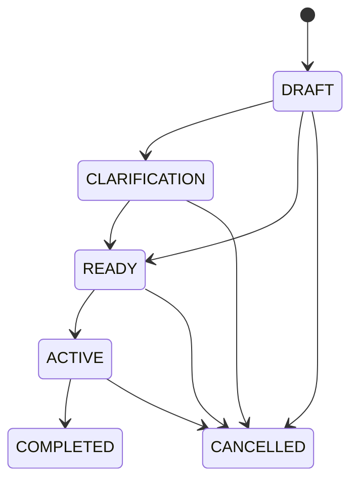
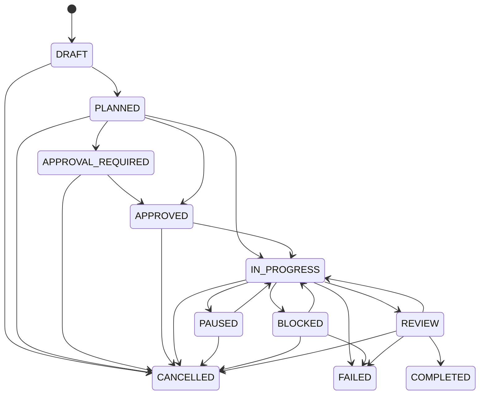

# Goal and Work Order lifecycle

## Intake and planning

`GoalIntakeService` creates a stable Goal and deterministically identifies missing objective or acceptance criteria. It moves the Goal through `GoalStateMachine`; it does not ask an LLM or directly assign a status. A later UI/agent can collect answers and submit a legal transition.

`WorkOrderPlanner` accepts the exact structured envelope `work_order`, `tasks`, `dependencies`, `questions`, `assumptions`, and `risks`. Model output is treated as untrusted: code normalizes IDs/enums/timestamps, constructs domain values, validates the graph and budget, then moves the Work Order from DRAFT to PLANNED through `WorkOrderStateMachine`.

## Work Order content

The Phase 04 Work Order records organization, objective, one accountable owner, requester, deliverables, acceptance criteria, constraints, constitution version, risk, budget ID, UTC deadline, task IDs, approval requirement/decision, artifact references, lifecycle status/version and a completion-event marker.

`WorkOrderControlService` owns pause, resume and approval transitions. `CancellationService` cancels all non-completed Tasks before cancelling the Work Order. The completion evaluator derives final status from persisted Task states; scheduler code never trusts a model completion claim.

## Determinism and events

State-machine services return new versioned aggregates and can emit `AuditEvent` records. Scheduler completion transitions through REVIEW to COMPLETED and sets `completion_event_emitted`; replayed ticks see terminal persisted state and cannot emit completion again. Construction may choose an initial state, but Phase 04 application code changes status only through state machines.

## Legacy compatibility

The legacy `SkillAgent._decompose` and `_run_pipeline` path remains unchanged. `LegacyPipelineAdapter` can project an approved list of old sequential steps into a linear DAG with stable Task IDs and idempotency keys. It is not wired into production and therefore cannot alter existing execution.
